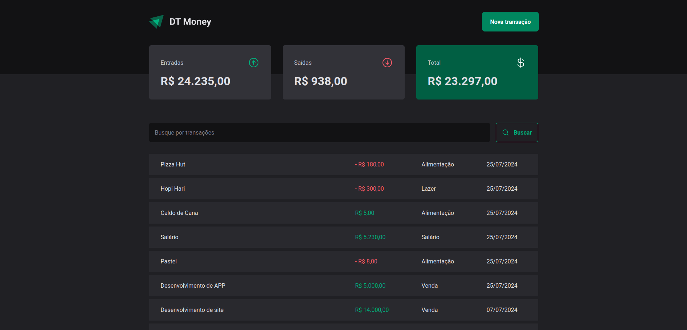

# Money Control!

<h1 align="center">
  
</h1>

> Projeto de estudo, desenvolvido através das aulas do curso Ignite da Escola Rocketseat. Se trata de um gerenciador de gastos, que permite o apontamento de gastos e ganhos, bem como a visualização do balanço final entre as finanças. A aplicação está conectada à um banco de dados fictício, chamado json-server, possibilitando assim as operações CRUD de forma similar à uma API verdadeira. 

## 💻 Pré-requisitos

Antes de começar, verifique se você atendeu aos seguintes requisitos:
* Você tem uma máquina `<Windows / Linux / Mac>`.
* Você tem o [git](https://git-scm.com) instalado na sua máquina.
* Você tem o [node](https://nodejs.org/en/) instalado na sua máquina.

## 🚀 Instalando Money Control

Para instalar o Money Control, siga estas etapas:

bash:
```
# Clone este repositório
$ git clone <https://github.com/vitorrdc/money-control>
# Acesse a pasta do projeto no terminal/cmd
$ cd money-control
# Instale as dependências
$ npm install ou yarn install
```

## ☕ Usando Money Control

Para usar Money Control, siga estas etapas:

bash:
```
# Acesse a pasta do projeto no terminal/cmd
$ cd money-control
# Execute a aplicação em modo de desenvolvimento
$ npm start ou yarn start
# O servidor inciará na porta:5173
# Agora é só acessar o endereço http://localhost:5173 no Browser de sua preferência
```

### 🛠 Tecnologias

As seguintes ferramentas foram usadas na construção do projeto:
- [React](https://reactjs.org/)
- [Typescript](https://www.typescriptlang.org/)
- [React Hook Form](https://react-hook-form.com/)
- [Styled Components](https://styled-components.com/)
- [Axios](https://axios-http.com/)
- [Json-Server](https://www.npmjs.com/package/json-server)


  
### 👨🏾‍💻 Autor
---

 

Feito com ❤️ por Vitor Ribeiro 👋🏽 Entre em contato!


[](mailto:vitor.camposrdc@gmail.com)

